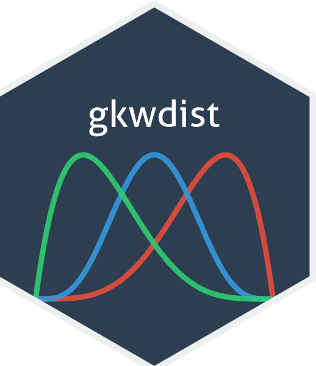

<!-- README.md is generated from README.Rmd. Please edit that file -->

# gkwdist: Generalized Kumaraswamy Distribution Family 

[](https://CRAN.R-project.org/package=gkwdist)
[](https://github.com/evandeilton/gkwdist/actions/workflows/R-CMD-check.yaml)
[](https://cran.r-project.org/package=gkwdist)
[](https://opensource.org/licenses/MIT)

## Overview

`gkwdist` implements the **Generalized Kumaraswamy (GKw)** distribution and its
seven nested sub-models for bounded continuous data on $(0,1)$ — proportions,
rates, shares, indices. It provides density, distribution, quantile and random
generation functions, and **analytical** log-likelihood, score and Hessian
functions, all written in C++ via RcppArmadillo.

- Seven nested distributions under one naming rule: prefix + family code.
- `ll*`, `gr*` and `hs*` drop straight into `stats::optim` — one pass over the
  data, no finite differences.
- Numerically stable in log space for observations near the boundaries, and the
  densities carry the limiting value at $x = 0$ and $x = 1$ as base R does.

## Cheat sheet

**[gkwdist cheat sheet (PDF)](https://evandeilton.github.io/gkwdist/cheatsheet/gkwdist-cheatsheet.pdf)**
· [view in the browser](https://evandeilton.github.io/gkwdist/cheatsheet/gkwdist-cheatsheet.html)

Two pages covering the whole package: the nesting tree, all 49 functions in one
matrix, the `d`/`p`/`q`/`r` contract, a gallery of the shapes the family
reaches, the maximum-likelihood recipe, the per-family `par` ordering, and the
nested-model map with likelihood-ratio degrees of freedom.

## Installation

``` r
# From CRAN
install.packages("gkwdist")

# Development version
# install.packages("devtools")
devtools::install_github("evandeilton/gkwdist")
```

## The distribution family

Every model below is GKw with parameters held fixed. Follow an edge to fix a
parameter and drop to a simpler model.

                              GKw(α, β, γ, δ, λ)
                    λ = 1       /      |      \       γ = 1
                              /    α = β = 1    \
              BKw(α, β, γ, δ)     Mc(γ, δ, λ)     KKw(α, β, δ, λ)
                            \          |                 |
                  α = β = 1   \      λ = 1             δ = 0
                                \      |                 |
                                  Beta(γ, δ)       EKw(α, β, λ)
                                                         |
                                                       λ = 1
                                                         |
                                                     Kw(α, β)

**Note:** Mc descends from GKw directly, by setting $\alpha = \beta = 1$.
It is *not* reachable from BKw, which has already fixed $\lambda = 1$:
setting $\alpha = \beta = 1$ in BKw gives Beta$(\gamma, \delta)$, which is
why both left-hand branches meet there. So Beta is obtained from Mc by
setting $\lambda = 1$, from BKw by setting $\alpha = \beta = 1$, or from
GKw by setting $\alpha = \beta = \lambda = 1$. The Kumaraswamy
distribution is obtained from EKw by setting $\lambda = 1$, or from GKw by
setting $\gamma = 1$, $\delta = 0$, $\lambda = 1$. The uniform is
GKw$(1, 1, 1, 0, 1)$ — $\delta$ is neutral at **0**, not 1, because it enters
the density through $B(\gamma, \delta+1)$ and $z^\delta$.

### All 49 functions

| Distribution | Code | Parameters | Functions |
|:---|:--:|:---|:---|
| **Generalized Kumaraswamy** | `gkw` | $\alpha, \beta, \gamma, \delta, \lambda$ | `dgkw`, `pgkw`, `qgkw`, `rgkw`, `llgkw`, `grgkw`, `hsgkw` |
| **Beta-Kumaraswamy** | `bkw` | $\alpha, \beta, \gamma, \delta$ | `dbkw`, `pbkw`, `qbkw`, `rbkw`, `llbkw`, `grbkw`, `hsbkw` |
| **Kumaraswamy-Kumaraswamy** | `kkw` | $\alpha, \beta, \delta, \lambda$ | `dkkw`, `pkkw`, `qkkw`, `rkkw`, `llkkw`, `grkkw`, `hskkw` |
| **Exponentiated Kumaraswamy** | `ekw` | $\alpha, \beta, \lambda$ | `dekw`, `pekw`, `qekw`, `rekw`, `llekw`, `grekw`, `hsekw` |
| **McDonald (Beta Power)** | `mc` | $\gamma, \delta, \lambda$ | `dmc`, `pmc`, `qmc`, `rmc`, `llmc`, `grmc`, `hsmc` |
| **Kumaraswamy** | `kw` | $\alpha, \beta$ | `dkw`, `pkw`, `qkw`, `rkw`, `llkw`, `grkw`, `hskw` |
| **Beta** | `beta_` | $\gamma, \delta$ | `dbeta_`, `pbeta_`, `qbeta_`, `rbeta_`, `llbeta`, `grbeta`, `hsbeta` |

`d*`, `p*`, `q*` and `r*` follow the base R convention. `ll*`, `gr*` and `hs*`
take `(par, data)` and return the **negative** log-likelihood, score and
Hessian, so they minimise directly under `optim()` and `hs*()` at the estimate
*is* the observed information.

Note the one irregular name: the Beta `d`/`p`/`q`/`r` keep a trailing
underscore so they do not mask `stats::dbeta`, but the likelihood trio does not
— `llbeta`, not `llbeta_`.

## Quick start

``` r
library(gkwdist)

x <- seq(0.01, 0.99, length.out = 100)

dgkw(x, alpha = 2, beta = 3, gamma = 1.5, delta = 2, lambda = 1.2)  # density
pgkw(x, 2, 3, 1.5, 2, 1.2)                                          # CDF
qgkw(c(0.25, 0.5, 0.75), 2, 3, 1.5, 2, 1.2)                         # quantiles

set.seed(123)
sample <- rgkw(1000, 2, 3, 1.5, 2, 1.2)                             # simulate
```

Maximum likelihood, with the analytical gradient and the observed information:

``` r
set.seed(2024)
data <- rkw(2000, alpha = 2.5, beta = 3.5)

fit <- optim(
  par     = gkwgetstartvalues(data, family = "kw"),
  fn      = llkw,   # negative log-likelihood
  gr      = grkw,   # negative score
  data    = data,
  method  = "BFGS",
  hessian = TRUE
)

est <- fit$par
se  <- sqrt(diag(solve(fit$hessian)))
cbind(Estimate = est, Lower = est - 1.96 * se, Upper = est + 1.96 * se)
```

`gkwgetstartvalues()` returns a named vector already in the order that family's
`ll*` expects — which differs between families, and is worth checking on the
cheat sheet before writing `par` by hand.

## Learn more

- **[Cheat sheet](https://evandeilton.github.io/gkwdist/cheatsheet/gkwdist-cheatsheet.pdf)**
  — the whole package on two pages.
- `vignette("gkwdist")` — a worked introduction: fitting, model selection,
  profile likelihood, confidence regions, diagnostics.
- `vignette("theory-gkwdist")` — the densities, CDFs and quantiles of all seven
  sub-families with proofs, the score and observed information in closed form,
  and the identifiability and boundary conditions behind the asymptotics.
- [Function reference](https://evandeilton.github.io/gkwdist/reference/) — every
  function, with runnable examples.

## References

- **Carrasco, J. M. F., Ferrari, S. L. P., & Cordeiro, G. M. (2010).** A
  new generalized Kumaraswamy distribution. *arXiv:1004.0911*.
  [arxiv.org/abs/1004.0911](https://arxiv.org/abs/1004.0911)

- **Cordeiro, G. M., & de Castro, M. (2011).** A new family of
  generalized distributions. *Journal of Statistical Computation and
  Simulation*, 81(7), 883-898.
  [doi:10.1080/00949650903530745](https://doi.org/10.1080/00949650903530745)

- **Kumaraswamy, P. (1980).** A generalized probability density function
  for double-bounded random processes. *Journal of Hydrology*, 46(1-2),
  79-88.
  [doi:10.1016/0022-1694(80)90036-0](https://doi.org/10.1016/0022-1694(80)90036-0)

- **Jones, M. C. (2009).** Kumaraswamy's distribution: A beta-type
  distribution with some tractability advantages. *Statistical
  Methodology*, 6(1), 70-81.
  [doi:10.1016/j.stamet.2008.04.001](https://doi.org/10.1016/j.stamet.2008.04.001)

- **Nadarajah, S., Cordeiro, G. M., & Ortega, E. M. (2012).** The
  exponentiated Kumaraswamy distribution. *Journal of the Franklin
  Institute*, 349(3), 1180-1214.

- **McDonald, J. B. (1984).** Some generalized functions for the size
  distribution of income. *Econometrica*, 52(3), 647-663.
  [doi:10.2307/1913469](https://doi.org/10.2307/1913469)

- **Cordeiro, G. M., & Brito, R. S. (2012).** The beta power
  distribution. *Brazilian Journal of Probability and Statistics*,
  26(1), 88-112.
  [doi:10.1214/10-BJPS124](https://doi.org/10.1214/10-BJPS124)

------------------------------------------------------------------------

## Citation

``` r
citation("gkwdist")
```

``` bibtex
@Manual{gkwdist2025,
  title  = {gkwdist: Generalized Kumaraswamy Distribution Family},
  author = {José Evandeilton Lopes},
  year   = {2025},
  note   = {R package},
  url    = {https://github.com/evandeilton/gkwdist}
}
```

## Author

**José Evandeilton Lopes**
LEG - Laboratory of Statistics and Geoinformation
PPGMNE - Graduate Program in Numerical Methods in Engineering
Federal University of Paraná (UFPR), Brazil
Email: <evandeilton@gmail.com>

------------------------------------------------------------------------

## License

MIT License. See [LICENSE](LICENSE) file for details.
