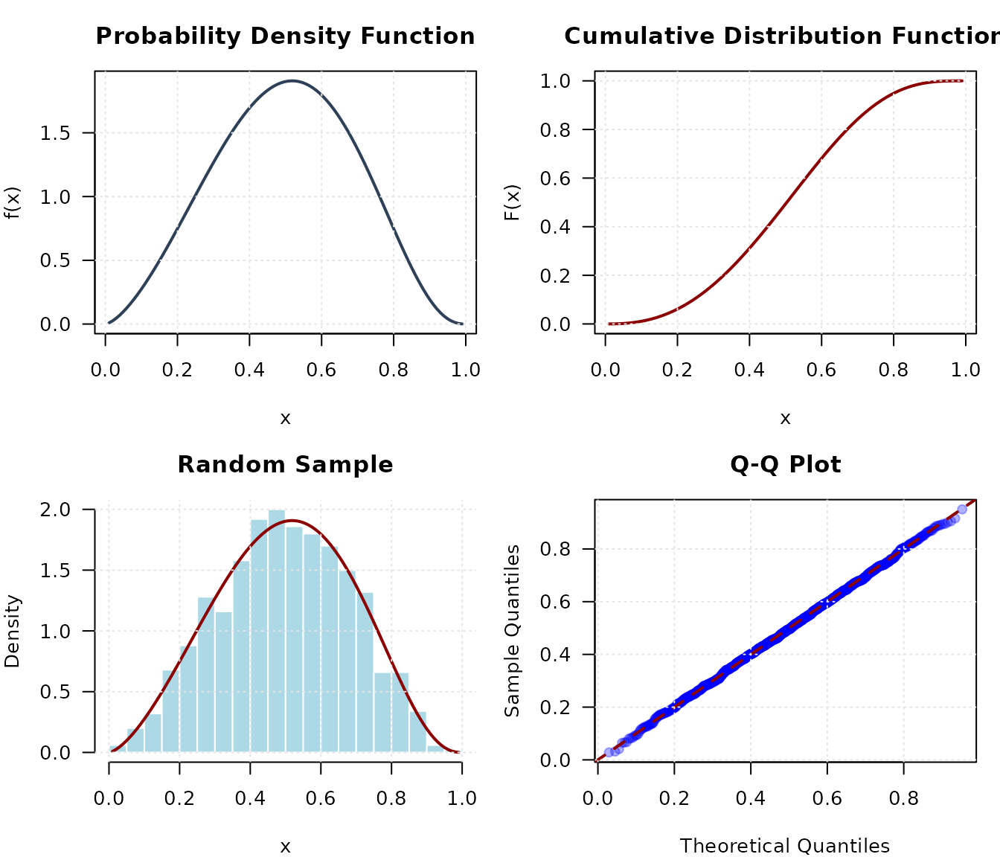
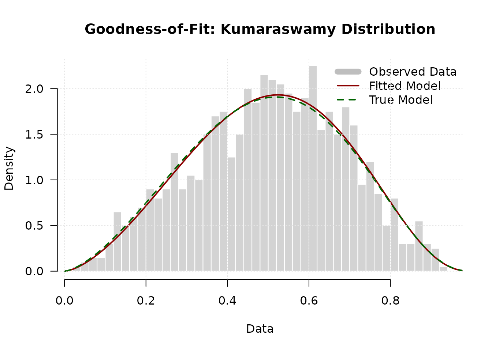
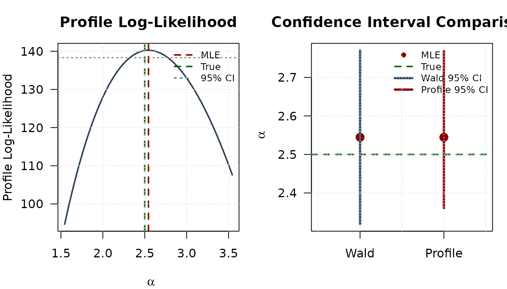
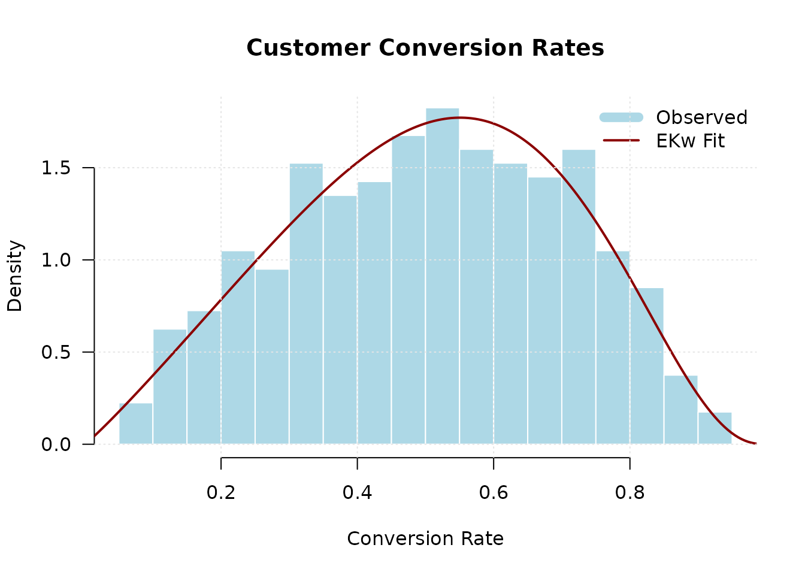

# Introduction to gkwdist: Generalized Kumaraswamy Distribution Family

## Introduction

The **gkwdist** package provides a comprehensive implementation of the
Generalized Kumaraswamy (GKw) distribution family for modeling bounded
continuous data on the unit interval $(0,1)$. All functions are
implemented in C++ via RcppArmadillo, providing substantial performance
improvements over pure R implementations.

### Key Features

- **Seven nested distributions**: GKw, BKw, KKw, EKw, Mc, Kw, and Beta
- **Standard distribution functions**: density, CDF, quantile, and
  random generation
- **Analytical derivatives**: log-likelihood, gradient, and Hessian for
  efficient inference
- **High performance**: C++ implementation with 10-100× speedup
- **No external dependencies**: Uses only base R functions in examples

``` r
library(gkwdist)
```

------------------------------------------------------------------------

## The Distribution Family

### Mathematical Foundation

The five-parameter Generalized Kumaraswamy distribution has probability
density function:

$$f(x;\alpha,\beta,\gamma,\delta,\lambda) = \frac{\lambda\alpha\beta x^{\alpha - 1}}{B(\gamma,\delta + 1)}\left( 1 - x^{\alpha} \right)^{\beta - 1}\left\lbrack 1 - \left( 1 - x^{\alpha} \right)^{\beta} \right\rbrack^{\gamma\lambda - 1}\{ 1 - \left\lbrack 1 - \left( 1 - x^{\alpha} \right)^{\beta} \right\rbrack^{\lambda}\}^{\delta}$$

for $x \in (0,1)$ and all parameters positive, where
$B( \cdot , \cdot )$ denotes the beta function.

### Nested Sub-families

The GKw distribution generalizes several important distributions:

| Distribution                    | Parameters    | Relationship  |
|:--------------------------------|:--------------|:--------------|
| Generalized Kumaraswamy (GKw)   | α, β, γ, δ, λ | Full model    |
| Beta-Kumaraswamy (BKw)          | α, β, γ, δ    | λ = 1         |
| Kumaraswamy-Kumaraswamy (KKw)   | α, β, δ, λ    | γ = 1         |
| Exponentiated Kumaraswamy (EKw) | α, β, λ       | γ = 1, δ = 0  |
| McDonald (Mc)                   | γ, δ, λ       | α = β = 1     |
| Kumaraswamy (Kw)                | α, β          | γ = δ = λ = 1 |
| Beta                            | γ, δ          | α = β = λ = 1 |

Nested Structure of GKw Family

------------------------------------------------------------------------

## Basic Distribution Functions

### Density, CDF, Quantile, and Random Generation

All distributions follow the standard R naming convention:

``` r
# Set parameters for Kumaraswamy distribution
alpha <- 2.5
beta <- 3.5

# Density
x <- seq(0.01, 0.99, length.out = 100)
density <- dkw(x, alpha, beta)

# CDF
cdf_values <- pkw(x, alpha, beta)

# Quantile function
probabilities <- c(0.25, 0.5, 0.75)
quantiles <- qkw(probabilities, alpha, beta)

# Random generation
set.seed(123)
random_sample <- rkw(1000, alpha, beta)
```

### Visualization

``` r
# PDF
plot(x, density,
  type = "l", lwd = 2, col = "#2E4057",
  main = "Probability Density Function",
  xlab = "x", ylab = "f(x)", las = 1
)
grid(col = "gray90")
```



``` r

# CDF
plot(x, cdf_values,
  type = "l", lwd = 2, col = "#8B0000",
  main = "Cumulative Distribution Function",
  xlab = "x", ylab = "F(x)", las = 1
)
grid(col = "gray90")
```


``` r

# Histogram with theoretical density
hist(random_sample,
  breaks = 30, probability = TRUE,
  col = "lightblue", border = "white",
  main = "Random Sample", xlab = "x", ylab = "Density", las = 1
)
lines(x, density, col = "#8B0000", lwd = 2)
grid(col = "gray90")
```


``` r

# Q-Q plot
theoretical_q <- qkw(ppoints(length(random_sample)), alpha, beta)
empirical_q <- sort(random_sample)
plot(theoretical_q, empirical_q,
  pch = 19, col = rgb(0, 0, 1, 0.3),
  main = "Q-Q Plot", xlab = "Theoretical Quantiles",
  ylab = "Sample Quantiles", las = 1
)
abline(0, 1, col = "#8B0000", lwd = 2, lty = 2)
grid(col = "gray90")
```


------------------------------------------------------------------------

## Comparing Distribution Shapes

### Flexibility Across Families

``` r
x_grid <- seq(0.001, 0.999, length.out = 500)

# Compute densities
d_gkw <- dgkw(x_grid, 2, 3, 1.5, 2, 1.2)
d_bkw <- dbkw(x_grid, 2, 3, 1.5, 2)
d_ekw <- dekw(x_grid, 2, 3, 1.5)
d_kw <- dkw(x_grid, 2, 3)
d_beta <- dbeta_(x_grid, 2, 3)

# Plot comparison
plot(x_grid, d_gkw,
  type = "l", lwd = 2, col = "#2E4057",
  ylim = c(0, max(d_gkw, d_bkw, d_ekw, d_kw, d_beta)),
  main = "Density Comparison Across Families",
  xlab = "x", ylab = "Density", las = 1
)
lines(x_grid, d_bkw, lwd = 2, col = "#8B0000")
lines(x_grid, d_ekw, lwd = 2, col = "#006400")
lines(x_grid, d_kw, lwd = 2, col = "#FFA07A")
lines(x_grid, d_beta, lwd = 2, col = "#808080")

legend("topright",
  legend = c(
    "GKw (5 par)", "BKw (4 par)", "EKw (3 par)",
    "Kw (2 par)", "Beta (2 par)"
  ),
  col = c("#2E4057", "#8B0000", "#006400", "#FFA07A", "#808080"),
  lwd = 2, bty = "n", cex = 0.9
)
grid(col = "gray90")
```


------------------------------------------------------------------------

## Maximum Likelihood Estimation

### Basic MLE Workflow

``` r
# Generate synthetic data
set.seed(2024)
n <- 1000
true_params <- c(alpha = 2.5, beta = 3.5)
data <- rkw(n, true_params[1], true_params[2])

# Maximum likelihood estimation
fit <- optim(
  par = c(2, 3), # Starting values
  fn = llkw, # Negative log-likelihood
  gr = grkw, # Analytical gradient
  data = data,
  method = "BFGS",
  hessian = TRUE
)

# Extract results
mle <- fit$par
names(mle) <- c("alpha", "beta")
se <- sqrt(diag(solve(fit$hessian)))
```

### Inference Results

``` r
# Construct summary table
results <- data.frame(
  Parameter = c("alpha", "beta"),
  True = true_params,
  MLE = mle,
  SE = se,
  CI_Lower = mle - 1.96 * se,
  CI_Upper = mle + 1.96 * se,
  Coverage = (mle - 1.96 * se <= true_params) &
    (true_params <= mle + 1.96 * se)
)

knitr::kable(results,
  digits = 4,
  caption = "Maximum Likelihood Estimates with 95% Confidence Intervals"
)
```

|       | Parameter | True |    MLE |     SE | CI_Lower | CI_Upper | Coverage |
|:------|:----------|-----:|-------:|-------:|---------:|---------:|:---------|
| alpha | alpha     |  2.5 | 2.5547 | 0.0816 |   2.3948 |   2.7147 | TRUE     |
| beta  | beta      |  3.5 | 3.5681 | 0.1926 |   3.1905 |   3.9457 | TRUE     |

Maximum Likelihood Estimates with 95% Confidence Intervals

``` r

# Information criteria
cat("\nModel Fit Statistics:\n")
#> 
#> Model Fit Statistics:
cat("Log-likelihood:", -fit$value, "\n")
#> Log-likelihood: 281.6324
cat("AIC:", 2 * fit$value + 2 * length(mle), "\n")
#> AIC: -559.2649
cat("BIC:", 2 * fit$value + length(mle) * log(n), "\n")
#> BIC: -549.4494
```

### Goodness-of-Fit Assessment

``` r
# Fitted vs true density
x_grid <- seq(0.001, 0.999, length.out = 200)
fitted_dens <- dkw(x_grid, mle[1], mle[2])
true_dens <- dkw(x_grid, true_params[1], true_params[2])

hist(data,
  breaks = 40, probability = TRUE,
  col = "lightgray", border = "white",
  main = "Goodness-of-Fit: Kumaraswamy Distribution",
  xlab = "Data", ylab = "Density", las = 1
)
lines(x_grid, fitted_dens, col = "#8B0000", lwd = 2)
lines(x_grid, true_dens, col = "#006400", lwd = 2, lty = 2)
legend("topright",
  legend = c("Observed Data", "Fitted Model", "True Model"),
  col = c("gray", "#8B0000", "#006400"),
  lwd = c(8, 2, 2), lty = c(1, 1, 2), bty = "n"
)
grid(col = "gray90")
```



------------------------------------------------------------------------

## Model Selection

### Comparing Nested Models

``` r
# Generate data from EKw distribution
set.seed(456)
n <- 1500
data_ekw <- rekw(n, alpha = 2, beta = 3, lambda = 1.5)

# Define candidate models
models <- list(
  Beta = list(
    fn = llbeta,
    gr = grbeta,
    start = c(2, 2),
    npar = 2
  ),
  Kw = list(
    fn = llkw,
    gr = grkw,
    start = c(2, 3),
    npar = 2
  ),
  EKw = list(
    fn = llekw,
    gr = grekw,
    start = c(2, 3, 1.5),
    npar = 3
  ),
  Mc = list(
    fn = llmc,
    gr = grmc,
    start = c(2, 2, 1.5),
    npar = 3
  )
)

# Fit all models
results_list <- lapply(names(models), function(name) {
  m <- models[[name]]
  fit <- optim(
    par = m$start,
    fn = m$fn,
    gr = m$gr,
    data = data_ekw,
    method = "BFGS"
  )

  loglik <- -fit$value
  data.frame(
    Model = name,
    nPar = m$npar,
    LogLik = loglik,
    AIC = -2 * loglik + 2 * m$npar,
    BIC = -2 * loglik + m$npar * log(n),
    Converged = fit$convergence == 0
  )
})

# Combine results
comparison <- do.call(rbind, results_list)
comparison <- comparison[order(comparison$AIC), ]
rownames(comparison) <- NULL

knitr::kable(comparison,
  digits = 2,
  caption = "Model Selection via Information Criteria"
)
```

| Model | nPar | LogLik |     AIC |     BIC | Converged |
|:------|-----:|-------:|--------:|--------:|:----------|
| Kw    |    2 | 461.90 | -919.80 | -909.17 | TRUE      |
| Beta  |    2 | 461.54 | -919.09 | -908.46 | TRUE      |
| Mc    |    3 | 462.32 | -918.63 | -902.69 | TRUE      |
| EKw   |    3 | 462.17 | -918.35 | -902.41 | TRUE      |

Model Selection via Information Criteria

### Interpretation

``` r
best_model <- comparison$Model[1]
cat("\nBest model by AIC:", best_model, "\n")
#> 
#> Best model by AIC: Kw
cat("Best model by BIC:", comparison$Model[which.min(comparison$BIC)], "\n")
#> Best model by BIC: Kw

# Delta AIC
comparison$Delta_AIC <- comparison$AIC - min(comparison$AIC)
cat("\nΔAIC relative to best model:\n")
#> 
#> ΔAIC relative to best model:
print(comparison[, c("Model", "Delta_AIC")])
#>   Model Delta_AIC
#> 1    Kw 0.0000000
#> 2  Beta 0.7129854
#> 3    Mc 1.1677176
#> 4   EKw 1.4528716
```

------------------------------------------------------------------------

## Advanced Topics

### Profile Likelihood

Profile likelihood provides more accurate confidence intervals than Wald
intervals, especially for small samples or near parameter boundaries.

``` r
# Generate data
set.seed(789)
data_profile <- rkw(500, alpha = 2.5, beta = 3.5)

# Fit model
fit_profile <- optim(
  par = c(2, 3),
  fn = llkw,
  gr = grkw,
  data = data_profile,
  method = "BFGS",
  hessian = TRUE
)

mle_profile <- fit_profile$par

# Compute profile likelihood for alpha
alpha_grid <- seq(mle_profile[1] - 1, mle_profile[1] + 1, length.out = 50)
alpha_grid <- alpha_grid[alpha_grid > 0]
profile_ll <- numeric(length(alpha_grid))

for (i in seq_along(alpha_grid)) {
  profile_fit <- optimize(
    f = function(beta) llkw(c(alpha_grid[i], beta), data_profile),
    interval = c(0.1, 10),
    maximum = FALSE
  )
  profile_ll[i] <- -profile_fit$objective
}

# Plot

# Profile likelihood
chi_crit <- qchisq(0.95, df = 1)
threshold <- max(profile_ll) - chi_crit / 2

plot(alpha_grid, profile_ll,
  type = "l", lwd = 2, col = "#2E4057",
  main = "Profile Log-Likelihood",
  xlab = expression(alpha), ylab = "Profile Log-Likelihood", las = 1
)
abline(v = mle_profile[1], col = "#8B0000", lty = 2, lwd = 2)
abline(v = 2.5, col = "#006400", lty = 2, lwd = 2)
abline(h = threshold, col = "#808080", lty = 3, lwd = 1.5)
legend("topright",
  legend = c("MLE", "True", "95% CI"),
  col = c("#8B0000", "#006400", "#808080"),
  lty = c(2, 2, 3), lwd = 2, bty = "n", cex = 0.8
)
grid(col = "gray90")
```



``` r

# Wald vs Profile CI comparison
se_profile <- sqrt(diag(solve(fit_profile$hessian)))
wald_ci <- mle_profile[1] + c(-1.96, 1.96) * se_profile[1]
profile_ci <- range(alpha_grid[profile_ll >= threshold])

plot(1:2, c(mle_profile[1], mle_profile[1]),
  xlim = c(0.5, 2.5),
  ylim = range(c(wald_ci, profile_ci)),
  pch = 19, col = "#8B0000", cex = 1.5,
  main = "Confidence Interval Comparison",
  xlab = "", ylab = expression(alpha), xaxt = "n", las = 1
)
axis(1, at = 1:2, labels = c("Wald", "Profile"))

# Add CIs
segments(1, wald_ci[1], 1, wald_ci[2], lwd = 3, col = "#2E4057")
segments(2, profile_ci[1], 2, profile_ci[2], lwd = 3, col = "#8B0000")
abline(h = 2.5, col = "#006400", lty = 2, lwd = 2)

legend("topright",
  legend = c("MLE", "True", "Wald 95% CI", "Profile 95% CI"),
  col = c("#8B0000", "#006400", "#2E4057", "#8B0000"),
  pch = c(19, NA, NA, NA), lty = c(NA, 2, 1, 1),
  lwd = c(NA, 2, 3, 3), bty = "n", cex = 0.8
)
grid(col = "gray90")
```


### Confidence Regions

For multivariate inference, confidence ellipses show the joint
uncertainty of parameter estimates.

``` r
# Compute variance-covariance matrix
vcov_matrix <- solve(fit_profile$hessian)

# Create confidence ellipse (95%)
theta <- seq(0, 2 * pi, length.out = 100)
chi2_val <- qchisq(0.95, df = 2)

eig_decomp <- eigen(vcov_matrix)
ellipse <- matrix(NA, nrow = 100, ncol = 2)

for (i in 1:100) {
  v <- c(cos(theta[i]), sin(theta[i]))
  ellipse[i, ] <- mle_profile + sqrt(chi2_val) *
    (eig_decomp$vectors %*% diag(sqrt(eig_decomp$values)) %*% v)
}

# Marginal CIs
se_marg <- sqrt(diag(vcov_matrix))
ci_alpha_marg <- mle_profile[1] + c(-1.96, 1.96) * se_marg[1]
ci_beta_marg <- mle_profile[2] + c(-1.96, 1.96) * se_marg[2]

# Plot
plot(ellipse[, 1], ellipse[, 2],
  type = "l", lwd = 2, col = "#2E4057",
  main = "95% Joint Confidence Region",
  xlab = expression(alpha), ylab = expression(beta), las = 1
)

# Add marginal CIs
abline(v = ci_alpha_marg, col = "#808080", lty = 3, lwd = 1.5)
abline(h = ci_beta_marg, col = "#808080", lty = 3, lwd = 1.5)

# Add points
points(mle_profile[1], mle_profile[2], pch = 19, col = "#8B0000", cex = 1.5)
points(2.5, 3.5, pch = 17, col = "#006400", cex = 1.5)

legend("topright",
  legend = c("MLE", "True", "Joint 95% CR", "Marginal 95% CI"),
  col = c("#8B0000", "#006400", "#2E4057", "#808080"),
  pch = c(19, 17, NA, NA), lty = c(NA, NA, 1, 3),
  lwd = c(NA, NA, 2, 1.5), bty = "n"
)
grid(col = "gray90")
```


------------------------------------------------------------------------

## Performance Benchmarking

### Computational Efficiency

The C++ implementation provides substantial performance gains:

``` r
# Generate large dataset
n_large <- 10000
data_large <- rkw(n_large, 2, 3)

# Compare timings
system.time({
  manual_ll <- -sum(log(dkw(data_large, 2, 3)))
})

system.time({
  cpp_ll <- llkw(c(2, 3), data_large)
})

# Typical results: C++ is 10-50× faster
```

------------------------------------------------------------------------

## Practical Applications

### Example: Modeling Proportions

``` r
# Simulate customer conversion rates
set.seed(999)
n_customers <- 800

# Generate conversion rates from EKw distribution
conversion_rates <- rekw(n_customers, alpha = 1.8, beta = 2.5, lambda = 1.3)

# Fit model
fit_app <- optim(
  par = c(1.5, 2, 1),
  fn = llekw,
  gr = grekw,
  data = conversion_rates,
  method = "BFGS",
  hessian = TRUE
)

mle_app <- fit_app$par
names(mle_app) <- c("alpha", "beta", "lambda")

# Summary statistics
cat("Sample Summary:\n")
#> Sample Summary:
cat("Mean:", mean(conversion_rates), "\n")
#> Mean: 0.5039841
cat("Median:", median(conversion_rates), "\n")
#> Median: 0.5102676
cat("SD:", sd(conversion_rates), "\n\n")
#> SD: 0.2020025

cat("Model Estimates:\n")
#> Model Estimates:
print(round(mle_app, 3))
#>  alpha   beta lambda 
#>  3.435  3.584  0.606
```

``` r
# Visualization
x_app <- seq(0.001, 0.999, length.out = 200)
fitted_app <- dekw(x_app, mle_app[1], mle_app[2], mle_app[3])

hist(conversion_rates,
  breaks = 30, probability = TRUE,
  col = "lightblue", border = "white",
  main = "Customer Conversion Rates",
  xlab = "Conversion Rate", ylab = "Density", las = 1
)
lines(x_app, fitted_app, col = "#8B0000", lwd = 2)
legend("topright",
  legend = c("Observed", "EKw Fit"),
  col = c("lightblue", "#8B0000"),
  lwd = c(8, 2), bty = "n"
)
grid(col = "gray90")
```



------------------------------------------------------------------------

## Recommendations

### When to Use Each Distribution

| **Data Characteristics** | **Recommended Distribution**      | **Parameters** |
|:-------------------------|:----------------------------------|:---------------|
| Symmetric, unimodal      | Beta                              | 2              |
| Asymmetric, unimodal     | Kumaraswamy                       | 2              |
| Flexible unimodal        | Exponentiated Kumaraswamy         | 3              |
| Bimodal or U-shaped      | Generalized Kumaraswamy           | 5              |
| J-shaped (monotonic)     | Kumaraswamy or Beta               | 2              |
| Unknown shape            | Start with Kw, test nested models | 2-5            |

### Model Selection Workflow

1.  **Exploratory Analysis**: Examine histograms and summary statistics
2.  **Start Simple**: Fit Beta and Kumaraswamy (2 parameters)
3.  **Diagnostic Checking**: Use Q-Q plots and formal tests
4.  **Progressive Complexity**: Add parameters if needed (EKw → BKw →
    GKw)
5.  **Information Criteria**: Balance fit quality and parsimony using
    AIC/BIC
6.  **Validation**: Check residuals and perform cross-validation

------------------------------------------------------------------------

## Conclusion

The **gkwdist** package provides a comprehensive toolkit for modeling
bounded continuous data. Key advantages include:

- **Flexibility**: Seven nested distributions accommodate diverse data
  shapes
- **Efficiency**: C++ implementation ensures fast computation
- **Completeness**: Full suite of distribution and inference functions
- **Reliability**: Analytical derivatives guarantee numerical accuracy

### Further Reading

For theoretical details and applications, see:

- Carrasco, J. M. F., Ferrari, S. L. P., and Cordeiro, G. M. (2010). “A
  new generalized Kumaraswamy distribution.” *arXiv:1004.0911*.
- Jones, M. C. (2009). “Kumaraswamy’s distribution: A beta-type
  distribution with some tractability advantages.” *Statistical
  Methodology*, 6(1), 70-81.
- Kumaraswamy, P. (1980). “A generalized probability density function
  for double-bounded random processes.” *Journal of Hydrology*, 46(1-2),
  79-88.

------------------------------------------------------------------------

## Session Information

``` r
sessionInfo()
#> R version 4.5.2 (2025-10-31)
#> Platform: x86_64-pc-linux-gnu
#> Running under: Ubuntu 24.04.3 LTS
#> 
#> Matrix products: default
#> BLAS:   /usr/lib/x86_64-linux-gnu/openblas-pthread/libblas.so.3 
#> LAPACK: /usr/lib/x86_64-linux-gnu/openblas-pthread/libopenblasp-r0.3.26.so;  LAPACK version 3.12.0
#> 
#> locale:
#>  [1] LC_CTYPE=C.UTF-8       LC_NUMERIC=C           LC_TIME=C.UTF-8       
#>  [4] LC_COLLATE=C.UTF-8     LC_MONETARY=C.UTF-8    LC_MESSAGES=C.UTF-8   
#>  [7] LC_PAPER=C.UTF-8       LC_NAME=C              LC_ADDRESS=C          
#> [10] LC_TELEPHONE=C         LC_MEASUREMENT=C.UTF-8 LC_IDENTIFICATION=C   
#> 
#> time zone: UTC
#> tzcode source: system (glibc)
#> 
#> attached base packages:
#> [1] stats     graphics  grDevices utils     datasets  methods   base     
#> 
#> other attached packages:
#> [1] gkwdist_1.0.11
#> 
#> loaded via a namespace (and not attached):
#>  [1] digest_0.6.39          desc_1.4.3             R6_2.6.1              
#>  [4] numDeriv_2016.8-1.1    RcppArmadillo_15.2.2-1 fastmap_1.2.0         
#>  [7] xfun_0.54              magrittr_2.0.4         cachem_1.1.0          
#> [10] knitr_1.50             htmltools_0.5.8.1      rmarkdown_2.30        
#> [13] lifecycle_1.0.4        cli_3.6.5              sass_0.4.10           
#> [16] pkgdown_2.2.0          textshaping_1.0.4      jquerylib_0.1.4       
#> [19] systemfonts_1.3.1      compiler_4.5.2         tools_4.5.2           
#> [22] ragg_1.5.0             evaluate_1.0.5         bslib_0.9.0           
#> [25] Rcpp_1.1.0             yaml_2.3.10            jsonlite_2.0.0        
#> [28] rlang_1.1.6            fs_1.6.6
```
